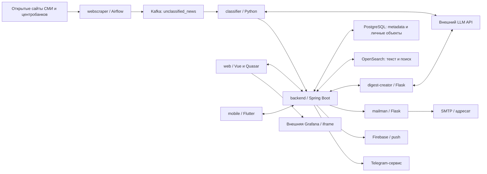

# Архитектура и границы доверия Crosswords

Область: исходное состояние `640de504f232d6cd99fc1bd35ead266d4bcbb824`. Диаграмма показывает логические взаимодействия, подтверждённые кодом. Она не изображает проверенную production-топологию, TLS или сетевые разрешения.

| Поток | Источник кода | Передаваемые данные | Граница и принимаемое решение |
| --- | --- | --- | --- |
| Сайт → скрапер → Kafka | [DAG](../product/webscraper/dags/web_scraper_hub_dag.py), [источники](../product/webscraper/dags/sources_config.py) | Заголовок, текст, URL, дата, источник, страна, summary | B2: открытый текст не становится доверенным; полнота/повтор требуют проверки. |
| Kafka → classifier → LLM → backend | [classifier](../product/classifier/news_service.py) | Новость, тематические теги и краткое содержание; технический Bearer к backend | B2/B3: допустимые теги проверяются; решение о подтверждении доставки отдельно от качества LLM. |
| Пользователь → web/mobile → API | [web routes](../product/backend-web/frontend/src/router/routes.js), [mobile API](../product/mobile/lib/services/api_service.dart), [SecurityConfig](../product/backend-web/backend/src/main/java/com/backend/crosswords/config/SecurityConfig.java) | Сессионные cookies, идентификаторы и параметры объектов | B1: роль и владелец проверяются сервером; скрытие кнопки не является разрешением. |
| Backend → два хранилища | [DocService](../product/backend-web/backend/src/main/java/com/backend/crosswords/corpus/services/DocService.java) | Metadata, личные связи и индексируемый текст | B5: PostgreSQL и OpenSearch не составляют одну общую транзакцию; согласованность при отказе не доказана. |
| Backend → digest-creator → LLM | [DigestService](../product/backend-web/backend/src/main/java/com/backend/crosswords/corpus/services/DigestService.java), [Flask](../product/digest-creator/digest_service.py) | Тексты/summary выбранных статей, результат генерации | B2/B3/B5: вход содержит недоверенное содержимое; ограничения размера и формата не доказывают достоверность. |
| Backend → уведомления | [MailManService](../product/backend-web/backend/src/main/java/com/backend/crosswords/corpus/services/MailManService.java), [mailman](../product/mailman/app.py), [Firebase](../product/backend-web/backend/src/main/java/com/backend/crosswords/corpus/services/FirebaseMessagingService.java), [Telegram](../product/backend-web/backend/src/main/java/com/backend/crosswords/corpus/services/TelegramNotificationService.java) | Адресаты, текст, ссылка, код подтверждения, push metadata | B3/B5: только согласованные получатели; недоверенный текст не превращается в HTML без оценки контекста. Реальные отправки не выполняются. |
| Исходник → зависимости → сборка → пакет | [Maven](../product/backend-web/backend/pom.xml), [web lock](../product/backend-web/frontend/package-lock.json), [mobile lock](../product/mobile/pubspec.lock) | Код и версии сторонних компонентов | B4: SHA проверенного кандидата совпадает с SHA пакета; build success не заменяет проверку S1–S6. |

В скрапере перечислены Интерфакс, Коммерсантъ и центробанки РФ, Узбекистана, Таджикистана, Кыргызстана, Азербайджана и Грузии. Наличие конфигураций не подтверждает, что все сайты доступны и скрапер работает на их сегодняшней разметке.

Для воспроизводимых проверок нужны синтетические пользователи/статьи, локальные заменители HTTP/SMTP/LLM и временные хранилища. Новостные сайты, действующий LLM, SMTP, Firebase, Telegram и Grafana не сканируются и не используются для отправки тестовых данных. Внешние интеграции не считаются «проверенными» только по успешной сборке.
