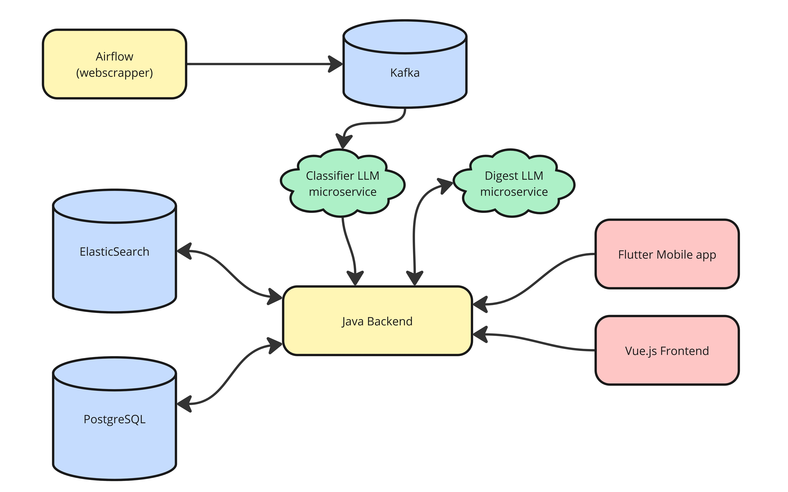

# Crosswords: учебный выпуск crosswords-course-v0.1

## 1. Паспорт проекта

Участники: Матвей и Максим.

Продукт: Crosswords - умный корпус текстов СМИ. Система собирает открытые новости, определяет их темы и готовит краткое содержание с помощью языковых моделей. В вебе и мобильном приложении доступны поиск, личные заметки, папки, тематические дайджесты и подписки.

Планируемый выпуск: crosswords-course-v0.1. Для него проверим выбранные сценарии и внесём одно полезное улучшение. Выпуск объединяет шесть компонентов; их собственные номера версий сохраняются. Его состав зафиксируем общим коммитом, поскольку Docker-тег latest может указывать на разные образы. Тег ek1 относится к материалам экспертизы. Решение о выпуске продукта примем отдельно.

Исходное состояние: коммит учебного репозитория 640de504f232d6cd99fc1bd35ead266d4bcbb824. Код шести компонентов находится в учебной копии репозитория. Для курса мы взяли эту копию от 4 октября 2026 года. Она может отличаться от версии, которую защищали в ВКР в 2025 году.

Репозиторий: KcasTischaWattt/rpbo-GORILLA. Здесь храним учебную копию и материалы курса. Разработка исходных компонентов и их история остаются в отдельных репозиториях. Перед сдачей проверим доступ преподавателя к комплекту.

### Контекст и пользователи

Crosswords создавался в рамках ВКР 2025 года по запросу Т-Банка. Мы работаем с учебной копией, без доступа к инфраструктуре банка и данным его пользователей. Назначение продукта описано в командном ТЗ и ВКР по серверной части. Эти документы помогают понять задачу, а текущее состояние мы проверяем по коду и локальным запускам. Сведений о работе системы в банке у нас нет.

Аналитик читает новости, делает личные заметки и получает дайджесты. Владелец подписки задаёт её параметры и получателей, а модератор редактирует контент. Сборщик и классификатор обращаются к API как технические сервисы. Для нас важно, чтобы чужие личные данные оставались закрытыми, у краткого содержания сохранялась ссылка на источник, а ошибки обработки новостей были заметны.

Решение об учебном выпуске принимаем вместе, после проверки изменений друг друга. Это правило мы согласовали при разборе процесса. Вопросы эксплуатации системы в Т-Банке остаются за её владельцами. Преподаватель оценивает нашу работу и помогает уточнить рамки учебного проекта.

### Границы

В проект входит: вся учебная копия product/: Java backend и Vue web в backend-web, Flutter в mobile, Python-компоненты webscraper, classifier, digest-creator и mailman, их зависимости и настройки. Архитектуру разбираем для всех шести компонентов. Практические проверки сосредоточим на двух направлениях: доступе к личным объектам через сервер и клиенты, а также обработке новостей и ошибок Python-конвейера. По их результатам подготовим один учебный выпуск.

За пределами проекта: инфраструктура банка, корпоративный SSO, действующие аккаунты SMTP, Telegram и Firebase, обучение и полная оценка моделей, аудит внешних сайтов и LLM-сервисов. Сертификацию по стандартам мы не проводим. Для проверок используем локальный стенд, тестовые данные и заменители внешних сервисов.

Изменяемая область: учебная копия, её локальные настройки и проверки. Исходные репозитории и рабочие системы не меняем. Реальные письма не отправляем, к пользовательским аккаунтам не обращаемся.

### Компоненты, взаимодействия и границы доверия

Airflow собирает новости с открытых сайтов и отправляет их в Kafka. Классификатор читает сообщения, определяет темы и готовит краткое содержание с помощью LLM, затем передаёт результат Java backend. Backend обслуживает веб на Vue и мобильное приложение на Flutter, хранит данные в PostgreSQL и поисковом хранилище, а для дайджестов обращается к отдельному LLM-сервису.

На рисунке поисковое хранилище подписано ElasticSearch; в текущей учебной копии используется OpenSearch. Отправку писем выполняет mailman, уведомления также могут идти через Firebase и Telegram. Эти интеграции на схеме не показаны.

Мы выделили пять границ доверия: B1 между клиентом и API, B2 при обработке и выводе внешнего текста и ответа LLM, B3 между техническими сервисами, backend и рассылкой, B4 при сборке пакета из кода и зависимостей, B5 между backend, внешними уведомлениями и хранилищами. Права пользователя должен проверять сервер. Текст новости и ответ модели требуют проверки независимо от источника.

### Активы и существенные риски

| ID | Актив / свойство | Сценарий и существенность | Связь с решениями |
| --- | --- | --- | --- |
| R1 | Личные заметки, папки, подписки, получатели и права пользователя | Пользователь B читает или меняет объект A либо получает права модератора. Это угрожает личным данным и результатам работы пользователя. | B1; S1-S3; M1. Проверяем владельца и роль на сервере, добавляем сценарии отказа в доступе. |
| R2 | Полнота новостей и дайджестов, связь с источниками | После ошибки записи сообщение подтверждается и не попадает в повторную обработку. Аналитик получает неполный дайджест, не зная об этом. | B2/B3; G2; S4; M2. Проверяем ошибки, повторную обработку и статусы результата. |
| R3 | Безопасный вывод внешнего текста | Текст сайта или LLM попадает в разметку письма, меняет ссылку или содержит инструкции для генератора. Нужно отдельно проверять содержание выжимки и способ её вывода. | B2; S5; M2. Проверяем формат на тестовых данных, включая некорректный ответ модели. |
| R4 | Сессии, секреты сервисов и отправка уведомлений | Данные передаются без нужной защиты, секреты попадают в журнал или внутренний API доступен постороннему. Возможны чужой доступ и нежелательная рассылка. | B1/B3/B5; G3; S3/S6. Проверяем настройки и изоляцию стенда. |
| R5 | Код, зависимости и результаты проверки выпуска | Проверили одну версию, а опубликовали другую. Состав образа изменился или исключение приняли без проверки. | B4; G1/G3; S7. Фиксируем коммит, повторяем сборку и проверяем выпуск вдвоём. |

Это сценарии риска, которые мы будем проверять. Само их описание не означает, что в продукте уже найдены пять уязвимостей. Ожидаемое поведение и критерии S1-S7 приведены в разделе 2.

### Доступные материалы и ограничения

- У нас есть исходники, lock-файлы web/mobile, Python requirements, Maven wrapper, Docker-конфигурации, четыре вложенных workflow и документация в docs/.
- В истории учебного репозитория до baseline семь коммитов, включая перенос кода и добавление документов. История исходных репозиториев и их PR сюда не переносилась. Настройки защиты веток и результаты прежних CI нам неизвестны.
- Backend собран на OpenJDK 21.0.11 с целевой Java 17 и Maven 3.9.9, web - на Node 26.5.0/npm 11.17.0. Эти запуски проверяют сборку; работа сервисов и безопасность требуют отдельных проверок.
- В коде есть один backend-тест contextLoads и шаблонный Flutter-тест счётчика. Команда web test завершается успешно, но не запускает тесты. Сценарии R1-R4 они не проверяют.
- Локально проверен путь ошибки классификатора без Kafka, LLM и сетевых запросов. Все компоненты вместе и mobile пока не запускались. Firebase-конфигурация исключена из копии. Для M1/M2 предусмотрели проверки, которым не нужен доступ к рабочей инфраструктуре.
- Учебный код доступен для изменений и повторных проверок. При подготовке ЭК1 исходники продукта не меняли. Исходное состояние задаётся коммитом baseline.

Конфиденциальность: реальные персональные данные, секреты SMTP/LLM/Firebase, рабочие cookies и закрытые материалы не включаем в результаты проверок и не отправляем внешним моделям. В тестовых данных используем example.invalid и локальные сервисы. Секреты храним только в локальных настройках, исключённых из Git. Отчёт Gitleaks относится к подготовке snapshot; нового запуска сканера в этом комплекте нет.

Почему проект выполним: backend и web собираются, а выбранные сценарии можно проверить на существующем коде с локальными хранилищами и заменителями интеграций. Для проверки ошибок обработки не нужны внешние аккаунты и обучение LLM. Первым кандидатом на улучшение выбрали обработку неудачной отправки новости; окончательно решим после M1/M2. Если полный серверный стенд окажется недоступен, используем Spring MVC/service-тесты с подменёнными хранилищами, сохранив настоящую логику доступа. Ограничения такой проверки и отсутствие мобильной сборки укажем в результатах.

## 2. Методологическая основа

Основная рамка: NIST SP 800-218, SSDF 1.1, финальная публикация февраля 2022 года. Для курса фиксируем эту версию. Если понадобится другая редакция, отдельно объясним причину перехода.

Дополнительный источник: OWASP ASVS 5.0.0, официальный релиз. Из него берём отдельные требования к API, вебу и взаимодействию сервисов. Полную проверку уровня ASVS не проводим. Для мобильного клиента проверяем те же серверные правила доступа; отдельную оценку соответствия мобильной платформы не делаем.

Нам нужна основа для команды из двух человек, которая охватывает изменения, проверки, выпуск и работу с ошибками. Она должна подходить для Java, Python и Dart и помогать сохранять результаты по конкретной версии. Сравнили три варианта:

| Кандидат | Назначение, доступность | Пригодность и адаптация | Решение / ограничение |
| --- | --- | --- | --- |
| NIST SSDF 1.1 | Практики для всего жизненного цикла; официальный текст открыт | Можно выбрать нужные практики и распределить работу на двоих. Для каждой нужно определить действия, результаты и критерии | Выбираем основной. Конкретные тесты API разрабатываем сами. |
| OWASP SAMM 2.0 | Открытая модель развития и оценки практик разработки | Подходит для долгосрочного улучшения процессов. Для оценки зрелости нужны сведения об организации, которых в учебной копии нет | Не выбираем: сейчас готовим один выпуск и не оцениваем зрелость организации. Уровень SAMM не присваиваем. |
| IEC 62443-4-1:2018 | Безопасная разработка продуктов промышленной автоматизации; описание области применения открыто, полный текст платный | Отдельные этапы похожи, но Crosswords не относится к промышленным системам управления | Не выбираем из-за другой области применения. Полный текст мы не приобретали и его отдельные пункты не используем. |

### Семь адаптированных областей

Мы сверили практики с таблицей 1 SSDF 1.1 и договорились о правилах для Crosswords. Ниже описано, кто что делает и как проверяет результат. Выполнение этих правил будем подтверждать по ходу подготовки выпуска.

| ID / источник | Применимость и почему | Действие и ответственность | Результат и проверка выполнения | Упрощение |
| --- | --- | --- | --- | --- |
| A1 - PO.1.1, PO.1.2 | Частично: нужны требования к процессу и объектам R1-R5 | Матвей ведёт S1-S3, Максим - S4-S7. Партнёр сверяет их с активами и границами доверия | S1-S7 с критериями для К0. Если критериев нет, сначала уточняем задачу | Одна таблица вместо большого каталога. Нормативные обязанности банка не оценивали. |
| A2 - PO.2.1, PO.4.1 | Частично: автору нужен независимый проверяющий | У задачи есть автор и второй участник, который её проверяет. Правила К1-К3 согласовываем вместе | Запись в задаче и результат проверки. На К1 проверяем участие партнёра, на К3 - комплект результатов | Отдельного отдела безопасности нет. Если партнёр недоступен, проверку откладываем. |
| A3 - PS.1.1, PS.2.1, PS.3.1 | Частично: нужно сохранить точный состав общего выпуска | Максим фиксирует коммит и тег, Матвей сверяет версию с результатами проверок | На К3 проверяем, что результаты и пакет относятся к одному коммиту. Тег ek1 сохраняем после экспертизы | Используем Git и настройки сборки. Для проверки прав репозитория нужен доступ; подписание контейнеров в план не входит. |
| A4 - PW.1.1, PW.2.1 | Частично: изменения затрагивают границы B1-B5 | Автор описывает проверку владельца, роли, формата и обработку ошибки. Партнёр разбирает решение | Короткая запись в задаче или PR со ссылками на S и R для К0/К1 | Используем схему потоков и сценарии. Полное моделирование инфраструктуры и аудит внешнего LLM не проводим. |
| A5 - PW.7.1, PW.7.2 | Полностью в выбранной области: код и настройки доступны для проверки | Автор указывает затронутые участки. Партнёр проверяет изменения в backend/mobile либо конвейере/web. Найденные проблемы разбираем вместе | Запись о проверке, результатах и ограничениях на К1 | Начинаем с ручного разбора важных потоков. Автоматический инструмент выберем после лекций. |
| A6 - PW.8.1, PW.8.2 | Частично: сборка не проверяет права доступа и обработку ошибок | Матвей ведёт M1, Максим - M2. Каждый повторяет основные проверки партнёра | Команды, тестовые данные, версия и результат на К2, связанные с ожидаемым поведением | Два направления, тестовые данные и заменители сервисов. Полного сквозного покрытия пока нет. |
| A7 - RV.1.1, RV.2.1, RV.2.2, RV.3.1 | Частично: найденные проблемы нужно разбирать и предупреждать их повторение | Ответственный за компонент оценивает последствия и приоритет. Партнёр проверяет выводы, решение принимаем вместе | Записываем проблему, исправляем её или вводим ограничение, повторяем проверку и обновляем правило. Используем на К2/К3 и после выпуска | Сообщения принимаем через GitHub issue, без круглосуточного дежурства. Срок реакции определяем для учебной работы. |

ASVS помогает уточнить A1/A4/A6: v5.0.0-8.2.1, 8.2.2, 8.3.1 относятся к S1/S2; 3.3.2, 3.5.1 - к S3; 1.2.1, 2.2.2 - к S5; 12.2.1, 12.3.1 - к S6. Все сокращённые идентификаторы относятся к версии 5.0.0. S4 о доставке новостей мы сформулировали сами, исходя из работы продукта.

В курсовую работу не включаем корпоративное обучение, закупки, аудит рабочей инфраструктуры и круглосуточную эксплуатацию. Полную проверку ASVS тоже не проводим. Для дальнейшей работы нужно уточнить прежние проверки кода, настройки TLS и сети, права участников и ранее принятые риски. Методы M1/M2 и конкретное улучшение выберем после лекций 06-08.

### Требования к учебному выпуску

Для crosswords-course-v0.1 выбрали семь требований. Проверяем их в M1/M2, а результат используем на К0-К3. Все номера ASVS относятся к версии 5.0.0.

| ID | Требование и основа | Как проверяем | Ведущий / проверяющий |
| --- | --- | --- | --- |
| S1 | Личные объекты доступны владельцу. R1, A1/A4/A6, ASVS 8.2.2 | Пользователь B подставляет ID заметки, папки или закрытой подписки A. Сервер отказывает, данные не раскрываются и не меняются. Правила общих подписок задаём отдельно. | Матвей / Максим |
| S2 | Сервер проверяет роль при изменении контента. R1, ASVS 8.2.1, 8.3.1 | Гость и обычный пользователь не могут изменить статью прямым запросом; модератор выполняет разрешённую операцию. Сверяем ответ и состояние данных. | Матвей / Максим |
| S3 | Правила сессии определены явно. R1/R4, ASVS 3.3.2, 3.5.1 | Проверяем cookies, SameSite, обновление сессии, выход, неверную cookie и запрос с другого origin в браузере. Для CORS учитываем content type, preflight и серверные проверки. | Матвей / Максим |
| S4 | Ошибка обработки новости не скрывается подтверждением. R2, A4/A6/A7, требование продукта | Проверяем временный и постоянный отказ, успех и повтор. Сообщение остаётся для повтора или получает сохранённый статус отложенной обработки. Отдельно проверяем дубликаты. | Максим / Матвей |
| S5 | Внешний текст проверяется на входе и выходе. R3, ASVS 1.2.1, 2.2.2 | Подаём неверные JSON и теги, текст с HTML, недопустимые URL и слишком большой вход. Проверяем обработку ошибки, допустимые теги и экранирование текста и ссылок без реальной отправки письма. | Максим / Матвей |
| S6 | Соединения, секреты и внутренние сервисы защищены. R4, A1/A4, ASVS 12.2.1, 12.3.1 | Проверяем TLS и сетевые разрешения, отказ постороннему клиенту и отсутствие секретов в журнале. Локальный HTTP допустим только в изолированной среде с тестовыми данными. | Матвей - сессии, Максим - сервисы; взаимная проверка |
| S7 | Результаты относятся к конкретной версии. R5, A3 | Фиксируем коммит, версии зависимостей, настройки и тестовые данные. Выпускаем проверенную версию; после изменений повторяем затронутые проверки. | Максим / Матвей |

Публичную новость отличаем от личной заметки и списка получателей. Для общей подписки заранее определим приглашения, смену владельца и отписку. Выпуск откладываем при нарушении S1/S2 или неразобранной существенной проблеме S3-S6. Если важный сценарий проверить нельзя, отключаем его или откладываем выпуск. Приоритет определяем по затронутым данным, воспроизводимости и последствиям. Результат с заменителем сервиса относится только к локальной проверке.

## 3. Текущее состояние

### Выборка и фактический путь изменения

Мы проверили состав всех 544 файлов продукта и семь коммитов учебного репозитория, включая подготовку snapshot. Подробно разобрали 16 выбранных файлов, четыре вложенных workflow, тесты и настройки сборки. Построчный разбор всех файлов и всей истории исходных проектов в эту работу не входил. Документы в docs/ описывают проект 2025 года; выводы о текущем состоянии опираются на код и записанные запуски 2026 года.

Сначала мы перенесли зафиксированные версии из отдельных репозиториев в общую учебную копию. Затем добавили README и документы и приступили к подготовке ЭК1. Как раньше принимались продуктовые изменения и решения о выпуске, по этой истории не видно. Вложенный workflow backend содержит Maven-сборку с -DskipTests, публикацию образа и SSH-деплой. В учебном репозитории он не запускается как корневой GitHub workflow. У трёх Python-компонентов тоже есть сценарии сборки, публикации и развёртывания без запуска тестов. О прежних ручных проверках сведений у нас нет.

| Практика | Статус в выборке | Основание и ограничение |
| --- | --- | --- |
| Фиксация происхождения кода | Есть | Коммит baseline и источники компонентов записаны в описании snapshot. Права доступа к исходным репозиториям отдельно не проверялись. |
| Настройки сборки | Есть | Maven, npm lock, pubspec lock, requirements и Docker-конфигурации. Backend и web собраны. |
| Независимая проверка перед слиянием | Для прежней разработки не установлена | История PR и настройки защиты веток не перенесены. Подготовленный комплект ЭК1 мы проверили друг у друга; это не восстанавливает историю прежних проверок продукта. |
| Проверка пользовательских свойств перед выпуском | Результатов в комплекте нет | В backend-тесте contextLoads, шаблонном Flutter-тесте и команде web test нужных сценариев нет. О прежних CI и ручных проверках сведений нет, кроме документа ПМИ. |
| Выпуск и развёртывание | Описаны в workflow источников | Видны команды автоматизации, но нет журналов успешных запусков и записей о решениях по рискам. |
| Учёт и устранение ошибок после выпуска | Не установлено | В копии нет прежних issue, описаний инцидентов и решений по ним. |

### Полезные существующие элементы

В продукте уже есть полезные решения: фиксация baseline и разделение компонентов, секреты через окружение, исключение Firebase-файла, Spring Security и BCrypt, cookies с HttpOnly/Secure, проверка владельца заметки и принадлежности документа, фильтрация личных аннотаций в DocService, проверка тегов LLM и резервная модель, Vue-интерполяция основного текста вместо прямого HTML. Их сохраняем и учитываем при выборе тестов. Само наличие этих решений ещё не подтверждает все сценарии. Kafka разделяет обработку между компонентами, но ошибка G2 при этом остаётся.

### Существенные разрывы

G1. Не хватает проверок важных пользовательских сценариев.

- Область: S1-S3, сервер и оба клиента. По A6 нужно проверить поведение продукта, одной успешной сборки недостаточно.
- Наблюдение: contextLoads, старый Flutter-тест счётчика и команда web test без сценариев не проверяют доступ к чужим объектам, модерацию и браузерную сессию. Workflow пропускает backend-тесты. Других результатов для этих сценариев в комплекте нет.
- Разрыв: часть защитных проверок есть в коде, но их работу в нужных сценариях ещё надо проверить. Оснований объявлять IDOR-уязвимость у нас пока нет.
- Существенность: R1 связан с личными данными, R5 - с решением о выпуске. Приоритет высокий: сначала проверим несколько серверных сценариев отказа в доступе и уточним, сохранились ли прежние результаты.
- Ближайшее действие: Матвей уточняет прежние проверки и готовит M1. Максим проверяет, что тесты обращаются к серверной логике доступа, а не только к видимости кнопок.

G2. После ошибки отправки новости сообщение всё равно подтверждается.

- Область: обработка новости в классификаторе, S4. По A4/A6 у ошибки сохранения должен быть понятный результат и правило повторной обработки.
- Наблюдение: send_to_backend перехватывает исключение, но не сообщает вызывающему коду об ошибке. Затем main вызывает consumer.commit(). Локальная проверка исполняет эти две функции без изменений: после одной тестовой ошибки отправки происходит одно подтверждение сообщения.
- Разрыв: при фиксации offset код не различает успешное сохранение и ошибку отправки. После подтверждения повторное чтение сообщения группой потребителей Kafka не гарантировано. Потерю данных, реальные offsets и поведение после перезапуска брокера мы ещё не проверяли.
- Существенность: R2 - пропущенная новость может незаметно сделать корпус и дайджест неполными. Приоритет высокий: этот путь воспроизводится локально, и его можно улучшить в рамках нашей работы.
- Ближайшее действие: Максим проверяет в M2 временный HTTP-сбой и повтор, Матвей сопоставляет доставку с записью. Рассматриваем явный статус отправки, ограниченное число повторов, подтверждение после известного результата и проверку дубликатов. Реализацию выберем после первых запусков.

G3. Не хватает сведений о защите связи между компонентами и о проверенном составе выпуска.

- Область: B1/B3/B4/B5. По A1/A3 нужно определить, как защищены соединения и внутренние API, и зафиксировать состав выпуска.
- Наблюдение: mobile API использует HTTP и записывает тела запросов и ответов в журнал. Classifier и digest-creator тоже обращаются к LLM по HTTP. В файле mailman нет проверки межсервисного токена перед отправкой письма. У backend cookies помечены Secure, но полных настроек TLS, reverse proxy и сетевой изоляции в комплекте нет. Workflow с плавающими образами и пропуском тестов не даёт результатов проверки нашего выпуска.
- Разрыв: по доступным файлам неясно, где защищены соединения и доступ к сервисам, а также какой образ прошёл проверку. HTTP-адреса есть в коде. Доступность mailman из интернета, перехват данных и устройство рабочей сети не подтверждены.
- Существенность: R4/R5 затрагивают сессии, настройки сервисов, рассылку и состав пакета. Приоритет высокий для условий локального кандидата. Оценку инцидентам в банке мы не даём: сведений о них нет.
- Ближайшее действие: Максим описывает адреса локального стенда, ограничения внешних запросов и коммит проверяемой версии. Матвей проверяет соединения и сессии в M1. Реальных получателей и внешние аккаунты на стенде не используем. При решении о выпуске отдельно учтём, что полный мобильный сценарий пока не проверен.

Остаются и другие вопросы: формирование HTML-письма без экранирования под нужный контекст, включение текста статьи в инструкции LLM, отключённый CSRF и отсутствие явного SameSite. Первые два проверим в S5/M2, сессионные настройки - в S3/M1. Поведение в конкретном браузере, почтовом клиенте и модели пока неизвестно. Для вывода о защите или её обходе нужно проверить вместе настройки CORS, браузера и сервера.

## 4. Целевой Secure SDLC

Мы согласовали целевой процесс учебного выпуска. Он сохраняет полезные проверки из раздела 3, требует проверки работы партнёром и связывает результаты с конкретным коммитом. Если оснований для перехода дальше не хватает, любой из нас может его остановить.

### Роли, правила и контрольные точки

Мы распределили работу так: Матвей отвечает за backend/mobile и M1, а также записывает общее решение о выпуске. Максим отвечает за конвейер/web и M2, собирает результаты и пакет. Изменения каждого проверяет второй участник. Тот, кто собирает комплект или записывает решение, не может единолично отменить критерий проверки.

Для каждого значимого изменения записываем коммит, связанные R/S и границу доверия, автора и проверяющего, ожидаемое поведение. Затем смотрим код и настройки, выполняем нужные проверки и сохраняем результат вместе с ограничениями. Перед выпуском сверяем состав, условия сборки, открытые вопросы, исключения и повторную проверку улучшения. Решение принимаем вдвоём. Во всех проверках используем тестовые данные без реальных секретов и адресатов.

| Точка | Когда и вход | Исполнитель / второй взгляд | Проверяемый результат и решение |
| --- | --- | --- | --- |
| К0 - начало изменения | Задача, baseline, R/S, затронутая роль, граница или формат | Автор описывает задачу; партнёр проверяет цель, права и среду | План и сценарии проверки. Если непонятно, что проверяем или где безопасно это сделать, уточняем задачу. |
| К1 - перед слиянием | Diff, результат сборки, нужные тесты и анализ | Автор запускает проверки; партнёр смотрит diff, сценарии и ограничения | Проверка вторым участником со ссылкой на S. При нарушении важного требования или непонятном результате изменение не сливаем. |
| К2 - после проверок и улучшения | M1/M2 на исходной и изменённой версиях | Ответственный за направление; партнёр повторяет основные сценарии | Команды, тестовые данные, версии, результаты до и после. Разделяем подтверждённые проблемы, ложные срабатывания и открытые вопросы. |
| К3 - готовность выпуска | Один коммит, результаты, оставшиеся риски, исключения, инструкция | Максим собирает пакет; Матвей сверяет; решаем вместе | Решаем: выпускать в учебной среде, выпускать с условиями или отложить. Записываем причины и после этого создаём тег продукта. Тег экспертизы относится только к материалам курса. |
| К4 - после выпуска | Issue, версия и минимальные тестовые данные для повтора | Ответственный за компонент разбирает проблему; партнёр проверяет исправление | При необходимости ограничиваем функцию или откладываем следующий выпуск. Воспроизводим ошибку, исправляем, повторяем проверку и обновляем требование или тест. |

Задачу сначала разбираем на К0, затем готовим изменение и проверяем его на К1. После проверок и улучшения проходим К2, собираем комплект и принимаем решение на К3. После учебного выпуска работаем с ошибками по К4. Слияние изменений и выпуск - отдельные решения. К ЭК1 мы описали и разобрали этот процесс. Проверки будущего улучшения на К1-К4 ещё предстоят.

### Что включается по риску

- Меняем роли, cookies, заметки, папки или подписки - проверяем S1-S3/M1 и серверную логику доступа.
- Меняем входной текст, LLM, подтверждение или повтор сообщения, HTML/PDF/письмо - проверяем S4/S5/M2: отказ, повтор и некорректный вход.
- Меняем адрес сервиса, журналирование, секрет, proxy или отправку уведомления - проверяем S6: сетевые ограничения, TLS либо изолированный локальный стенд. Реальных отправок не делаем.
- Добавляем зависимость или образ - по S7 фиксируем версию, назначение и известные риски. Результаты автоматического анализа разбираем вручную.

Для G1 используем A6 и проверки M1 на К2/К3. Для G2 - A4/A6/A7 и M2 на К1/К2. Для G3 - A1/A3, изоляцию стенда и проверку состава на К0/К3. Для каждой проверки указали, какую проблему она помогает решить.

### Отклонения, полномочия и эскалация

Для открытого вопроса указываем требование S, известные сведения, ответственного и следующий шаг. Пока нужного результата нет, соответствующую контрольную точку не проходим.

Исключения принимаем вдвоём только для собственного изолированного стенда. Записываем затронутое правило и версию, причину, последствия, срок, дополнительные меры, ответственного и способ закрытия. Конкретный пример с mailman разобран ниже.

Сообщение о проблеме разбираем в следующий рабочий сеанс по проекту. Сначала определяем затронутый коммит, проверяем воспроизводимость и при необходимости ограничиваем проблемную функцию. Если данных не хватает, запрашиваем уточнение и оставляем issue открытым. Круглосуточного дежурства у нас нет. Секреты из внешних сообщений в открытые issue не переносим.

### Проверка жизнеспособности схемы

Мы вместе разобрали три ситуации и уточнили, как действовать в каждой.

- Ошибка записи новости. Максим готовит изменение по S4, Матвей проверяет временный и постоянный отказ. Просто убрать commit недостаточно: нужны предел повторов и защита от дублей после частично успешного запроса. На К2 сравниваем поведение до и после, на К3 используем результаты проверенного коммита.
- Проверяющий недоступен. Если Матвей изменил проверку роли, а Максим не может её посмотреть, К1 ждёт. Можно перенести работу или уменьшить изменение и снова пройти К0. Координатор выпуска не отменяет проверку партнёра; срок сдачи не заменяет её.
- Неизвестны сетевые ограничения mailman. На К0 выбираем локальный заменитель SMTP, на К3 оцениваем только наш стенд. Исключение согласуем вдвоём, с причиной, сроком и дополнительными мерами. Оно не даёт права отправлять письма реальным адресатам или раскрывать чужие данные. Если нужную интеграцию не удалось проверить, отключаем функцию либо откладываем выпуск; при разногласии обсуждаем учебные рамки с преподавателем.

Взаимную проверку провели: Матвей разобрал G1/S1-S3 и направление M2, Максим - G2/S4-S6 и M1. Каждый сверил выводы с кодом и обсудил ограничения части партнёра.

В рамках курса связываем требования с результатами, проводим два направления проверок, вносим одно полезное улучшение и повторяем сценарии. Затем описываем оставшиеся риски и принимаем решение по конкретному выпуску. Внедрение процесса во всей организации в эту работу не входит.

## 5. Предварительный технологический профиль

Методы и версии инструментов выберем после лекций 06-08. Учтём, что именно проверяет инструмент, доступен ли он нам, сколько занимает запуск и сможет ли партнёр повторить результат. Ниже - план M1/M2. Полученные сборки и локальная проверка из раздела 3 покрывают только часть этого плана.

### M1. Серверный доступ к личным объектам и сессионные границы

Риски/свойства: R1/R4, S1-S3/S6, G1/G3. Цель: проверить, как сервер различает гостя, владельца A, другого пользователя B и модератора. Права должны проверяться независимо от состояния интерфейса.

Область: SecurityConfig, JWTFilter, серверные сервисы заметок, папок и подписок, их API и запросы web/mobile. Используем тестовых пользователей, личные объекты, неверные и чужие идентификаторы. Дополнительно проверим cookies, защиту соединения и один браузерный запрос с другого origin. Корпоративный SSO, реальные Firebase-аккаунты и все варианты устройств в эту проверку не входят.

Этап и версия: проектирование К0, изменение К1, кандидат crosswords-course-v0.1 на К2/К3; baseline используем для сравнения. Ведущий: Матвей. Проверяющий: Максим повторяет отказ в доступе к чужой заметке и запрет редактирования статьи обычным пользователем, затем проверяет, что данные не изменились.

Метод/версия: начнём с карты API и Spring MVC/service-тестов с локальными хранилищами. Если стенд будет доступен, добавим HTTP-проверки. Версии сборочных инструментов записаны в материалах проверок, тестовую конфигурацию ещё выбираем. Логику авторизации берём из продукта; подменяем только необходимые зависимости.

Гипотезы: H1 - проверки владельца достаточны для выбранных операций; H2 - гость, пользователь и модератор получают разные результаты при попытке изменить контент; H3 - выход, обновление сессии и браузерные запросы обрабатываются по определённым правилам. Каждую гипотезу подтвердим, опровергнем примером или оставим открытой, если данных не хватит.

Ожидаемые свидетельства: таблица ролей, операций и объектов, тестовые данные, команды и результаты JUnit/HTTP, коммиты исходной и изменённой версий. При отказе проверим и ответ сервера, и неизменность объекта. Добавим выбранные проверки запросов клиента. Выводы будут относиться к этим операциям и условиям браузера.

### M2. Надёжная и безопасная обработка новости и дайджеста

Риски/свойства: R2/R3/R4, S4-S6, G2/G3. Цель: проверить, что после ошибки записи и повторной обработки остаётся понятный результат, а текст модели проходит ту же проверку, что и другой внешний текст.

Область: classifier, digest-creator, mailman и передача данных в backend. Проверяем временный HTTP-сбой, неверный ответ LLM, повтор сообщения, HTML-подобный текст и ссылки. Для скрапера используем тестовую новость без обращения к сайтам. Настоящую модель и брокер можно добавить на локальном стенде отдельным запуском. Качество реальных новостей и работу промышленной очереди этот этап не оценивает.

Этап и версия: К0/К1, сравнение исходной и изменённой версий на К2, результаты для К3. Ведущий: Максим. Проверяющий: Матвей повторяет отказ и проверяет, появилась ли запись либо явное состояние ошибки или отложенной обработки.

Метод/версия: начнём с исходных функций и Flask API с заменителями HTTP/SMTP, затем проверим повторные попытки и обработку сообщения. Для первой локальной проверки использована стандартная библиотека Python 3; исходный запуск выполнен на Python 3.9.6. Повторное чтение из настоящего Kafka проверим отдельно, если будет доступна среда.

Гипотезы: H4 - сообщение подтверждается только после известного результата обработки; H5 - повтор не создаёт незаметных дублей; H6 - допустимые теги, HTML и ссылки проверяются независимо от LLM. В локальной проверке baseline получили контрпример к H4: после ошибки отправки код подтверждает сообщение. Остальные сценарии M2 ещё предстоят.

Ожидаемые свидетельства: тестовые данные и ход обработки: после ошибки выполняется повтор или откладывается обработка, затем следуют сохранение и подтверждение. Отдельно запишем результаты успеха и постоянного отказа, число записей после повтора, ответы Flask и сформированный HTML без отправки писем. Проверки с заменителями не показывают реальные offsets Kafka, точность модели и поведение почтовых клиентов; устойчивость к prompt injection тоже потребует отдельных сценариев.

### Масштаб, зависимости и порядок работы

На работу планируем 40 человеко-часов, примерно по 20 на каждого. Требования и подготовка среды - 6; M1 - 8; M2 - 8; повторение результатов партнёром и их разбор - 6; одно улучшение и повторная проверка - 6; комплект выпуска - 4; резерв - 2. Если на среду уйдёт больше резерва, пересмотрим инструменты и запишем ограничения. Недоступную проверку не будем отмечать как пройденную.

Концепцию и распределение ролей мы разобрали вместе. После лекций 06-08 выберем методы и стенд, выполним M1/M2 на baseline и сравним возможные улучшения по пользе и трудоёмкости. Пока основной кандидат - G2, обработка результата отправки и подтверждение сообщения. После изменения повторим исходный сценарий и добавим успех, повтор и постоянный отказ. Затем соберём результаты, оставшиеся риски и решение К3. Даты уточним по календарю курса.

По S7 перед каждым запуском фиксируем состав и версии кандидата. После лекций можем добавить SAST/DAST/SCA, если выбранная проверка помогает оценить конкретное R/S. Результат без найденной уязвимости тоже полезен, если понятно, что проверили и на чём основан вывод.

## Использование генеративного ИИ

При подготовке этого комплекта использован ИИ: для работы с материалами, подготовки текста и вспомогательных проверок. Мы использовали учебный код, документацию и открытые источники. Реальные секреты и пользовательские данные в эту работу не включали.
